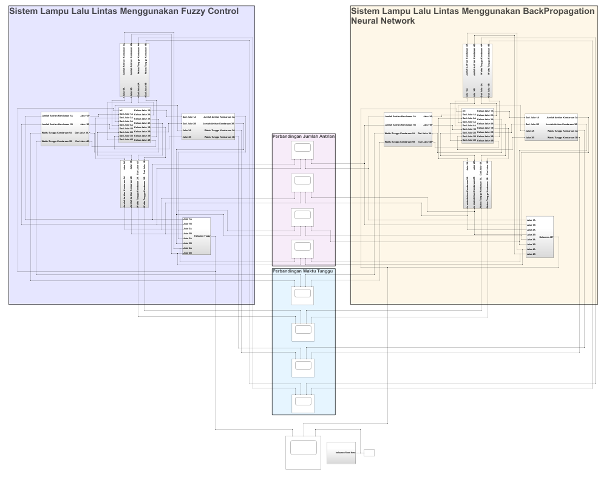

# Traffic-System-Simulation
Traffic system simulation with Fuzzy Controller &amp; Backpropagation Neural Network using Matlab Simulink

Traffic System Simulation with Matlab Simulink. This simulation is used to arrange the time of green lights based on vehicle amount. Using 4-side way (Nort, East, South, & West) and 2-direction (straight & turn-right).

## Urutan Pengaktifan Lampu Hijau
* Fixed Time
.PNG)

* Using Backpropagation Neural Network
.PNG)

* Using Fuzzy
.PNG)

## Perbandingan Urutan Lampu Hijau Menggunakan Fuzzy, Backpropagation Neural Network, & Fixed Time
.PNG)

## Waktu Lampu Hijau
* Waktu nyala lampu hijau menggunakan Fuzzy

* Waktu nyala lampu hijau menggunakan backpropagation neural network

## Perbandingan Waktu Tunggu Atara Fuzzy & Backpropagation Neural Network

* Sisi Utara
.PNG)

* Sisi Timur
.PNG)

* Sisi Selatan
.PNG)

* Sisi Barat
.PNG)

